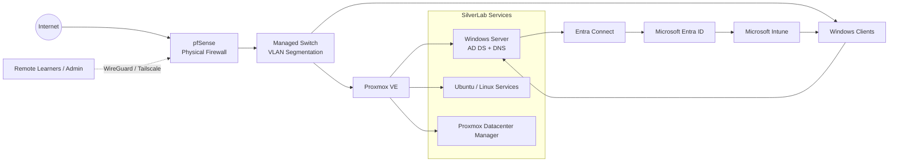

# SilverLab

**IT Support | Modern Workplace | Networking | Junior Infrastructure Portfolio**

SilverLab is a multi-user technical lab I built to turn IT study into practical, reviewable evidence. It combines Windows 11 support, Windows Server and Active Directory, Microsoft Entra ID and Intune, Proxmox virtualisation, pfSense networking, secure remote access, role-based permissions, troubleshooting and technical documentation.

**Portfolio:** this repository documents independent hands-on lab work. It is not presented as production enterprise administration or paid IT support experience.

[LinkedIn](https://www.linkedin.com/in/robertbrownuk/) · [Modern Workplace evidence](docs/modern-workplace-identity-endpoint.md) · [Infrastructure baseline](docs/core-infrastructure-current-baseline.md) · [Screenshot evidence](assets/screenshots/README.md)

---

## Recruiter Quick View

| Area | What I can demonstrate |
|---|---|
| **Windows & user support** | Windows 10/11 troubleshooting, sign-in/access issues, client configuration, domain join/disconnect, device enrolment and validation |
| **Identity & endpoint management** | Active Directory, Entra ID, Entra Connect, users/groups, Intune enrolment, MDM scope, group-targeted assignments, MFA testing and Windows Autopilot practice |
| **Networking & security** | TCP/IP, DNS, DHCP, NAT, VLANs, managed switching, pfSense firewalling/segmentation, WireGuard and Tailscale |
| **Virtualisation & access control** | Proxmox VE, Proxmox Datacenter Manager, Windows/Linux VMs, role-based learner access and protected infrastructure |
| **Support workflow** | Expected-versus-actual testing, fault isolation, Jira-based task/change documentation, GitHub evidence and structured handovers |

### Roles this portfolio is aligned with

- IT Support / Service Desk
- MSP 1st Line Support
- Desktop / EUC Support
- Junior Modern Workplace Support
- Junior Infrastructure / Network Support

---

## Featured Practical Evidence

### 1. Microsoft Modern Workplace: Entra ID, Intune and Windows 11

Extended the lab from on-premises Active Directory into hybrid/cloud identity and endpoint management.

- Configured Entra Connect hybrid identity synchronisation.
- Used Entra users and security groups for controlled assignments.
- Enrolled Windows 11 clients into Intune and validated device/assignment behaviour.
- Tested MDM scope, group-targeted policies, MFA and Windows Autopilot workflows.
- Troubleshot an access-policy issue by checking group membership, correcting the targeted SID, synchronising policy and re-testing the endpoint.
- Compared endpoint-based restrictions with identity-based approaches such as Conditional Access when selecting the appropriate control.

**Evidence:** [Modern Workplace - Identity and Endpoint Management](docs/modern-workplace-identity-endpoint.md)

### 2. Active Directory and Windows Client Support

- Built and maintained a Windows Server AD DS/DNS environment.
- Created users, groups and OUs and joined Windows clients to the domain.
- Practised Group Policy, domain connectivity, DNS and sign-in troubleshooting.
- Worked through local-administrator recovery and access-validation scenarios.

**Evidence:** [Active Directory, GPO and Client Validation](docs/active-directory-gpo-client-validation.md)

### 3. Physical pfSense Firewall and VLAN Segmentation

- Migrated pfSense from a VM to a dedicated Fujitsu Futro S720.
- Built a one-NIC router-on-a-stick design using a managed TP-Link switch.
- Separated protected lab traffic from the upstream/home network with dedicated VLANs.
- Used firewall rules, packet capture, routing checks and client troubleshooting to validate connectivity.

**Evidence:** [Core Infrastructure Current Baseline](docs/core-infrastructure-current-baseline.md)

### 4. Multi-User Proxmox and PDM Administration

- Created individual learner accounts for shared practical work.
- Troubleshot permissions for VM creation, storage, ISO access, bridges, snapshots and backups.
- Added Proxmox Datacenter Manager and tested role separation.
- Protected selected infrastructure from learner accounts and validated the result from a student test account.

This part of the lab is deliberately multi-user so access-control decisions can be tested rather than only described.

---

## Selected Troubleshooting Examples

### Intune / identity targeting

**Symptom:** a Windows sign-in restriction did not initially produce the expected result.

**Method:** checked group membership and identity targeting, corrected the SID used by the policy, synchronised the endpoint and re-tested after membership changes.

**Result:** the intended user restriction was validated and the exercise demonstrated the difference between configuration, assignment, synchronisation and endpoint enforcement.

### Remote-access connectivity

**Symptom:** a remote learner could not reach the protected lab as intended.

**Method:** checked WireGuard peer state, firewall rules, routing, packet capture and client-adapter configuration rather than changing multiple components at once.

**Result:** remote access to the protected lab was established while keeping the upstream household network outside the learner access boundary.

### Proxmox learner permissions

**Symptom:** learner accounts could sign in but lacked required VM/storage/bridge functions, while protected systems also needed to remain unavailable.

**Method:** tested permissions from learner accounts, adjusted role/pool boundaries and re-tested each capability.

**Result:** learners could use the intended lab resources while selected infrastructure remained hidden/protected.

---

## Architecture at a Glance

A more detailed network diagram and redacted screenshots are kept in the repository rather than placing every implementation detail on the landing page.

---

## Current Lab Scope

| Component | Purpose |
|---|---|
| **Proxmox VE** | Core virtualisation platform for server-side workloads |
| **Proxmox Datacenter Manager** | Central visibility and learner-access testing |
| **Windows Server** | Active Directory Domain Services and DNS |
| **Windows 11 clients** | User, domain, Intune and support testing |
| **Microsoft Entra ID / Entra Connect** | Hybrid identity and synchronisation practice |
| **Microsoft Intune** | Endpoint enrolment, assignments, MDM scope and policy validation |
| **pfSense** | Physical firewall, routing, segmentation and remote-access control |
| **Managed switch** | Tagged/untagged VLAN configuration |
| **WireGuard / Tailscale** | Controlled remote learner/admin access |
| **Ubuntu / Linux** | Linux administration and internal service hosting |
| **Jira + GitHub** | Work tracking, troubleshooting evidence and technical documentation |

---

## Documentation and Evidence

Rather than listing technologies alone, the repository records **what changed, why it was changed, how it was validated and what happened when it failed**.

Useful starting points:

- [Modern Workplace - Identity and Endpoint Management](docs/modern-workplace-identity-endpoint.md)
- [Core Infrastructure Current Baseline](docs/core-infrastructure-current-baseline.md)
- [Active Directory, GPO and Client Validation](docs/active-directory-gpo-client-validation.md)
- [Network Topology](docs/02-network-topology.md)
- [Proxmox Installation and Networking](docs/03-proxmox-installation-and-networking.md)
- [Secure Remote Access with Tailscale](docs/07-secure-remote-access-tailscale.md)
- [Windows Server Baseline](docs/11-windows-server-baseline.md)
- [SilverLab Progress Update - July 2026](docs/progress-update-2026-07.md)
- [Curated Screenshot Evidence](assets/screenshots/README.md)

---

## Working Method

For practical changes I try to follow the same support pattern:

1. Define the expected result.
2. Check the existing state before changing it.
3. Make a controlled change.
4. Validate from the affected user/device perspective.
5. Record the actual result.
6. Isolate the cause when expected and actual results differ.
7. Re-test and document the final state.

The aim is to demonstrate troubleshooting and support judgement, not simply successful installations.

---

## Security and Privacy

SilverLab is intentionally documented without publishing sensitive credentials or identifying infrastructure data. Public evidence excludes passwords, authentication tokens, private keys, public IP addresses, VPN configuration exports, personal identifiers, unredacted MAC addresses, serial numbers and certificate/key material.

Private lab addresses may appear where they are useful for explaining network design.

---

## Background

I am moving into a dedicated IT role after a career that included customer-facing technical environments, connected-fleet technology rollouts, stakeholder coordination and enterprise IT support-contract work. SilverLab is the practical evidence layer behind that transition: a place to build, break, troubleshoot, validate and document the technologies I am applying to support professionally.

**Current focus:** IT Support, Modern Workplace, networking and junior infrastructure.

[LinkedIn](https://www.linkedin.com/in/robertbrownuk/)
