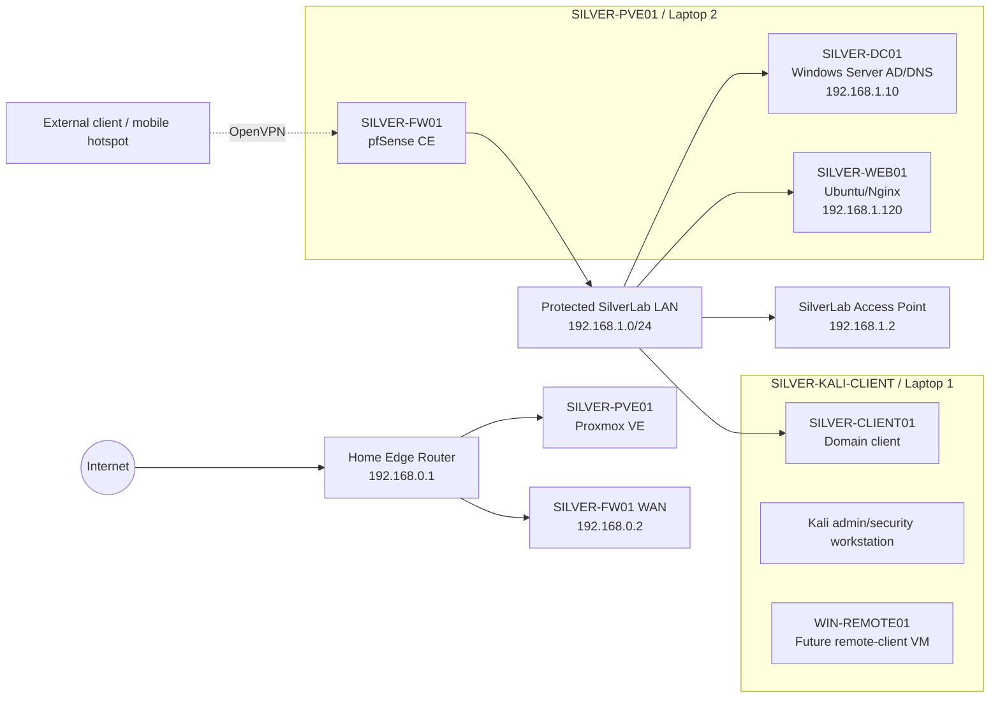

# SilverLab

SilverLab is a practical IT and cybersecurity homelab built to develop and demonstrate job-ready skills in virtualisation, networking, Windows Server, Active Directory, Linux administration, firewalling, VPN access, troubleshooting, documentation, and later security monitoring.

The lab uses repurposed laptop hardware and is documented as a small-business style environment: a Proxmox infrastructure host, a pfSense firewall, a protected lab LAN, Windows Server domain services, a domain-joined Windows client, and an internal Ubuntu/Nginx service.

## Current Status

| Area | Status |
|---|---|
| Proxmox VE host | Built and operational on **SILVER-PVE01** |
| Hardware baseline | Laptop 2 upgraded to approx. **16 GiB RAM** |
| Firewall / gateway | **pfSense CE** deployed as **SILVER-FW01** |
| Protected lab LAN | `192.168.1.0/24` behind pfSense |
| DHCP / DNS forwarding | pfSense provides client DHCP/DNS and forwards `silverlab.local` to the DC |
| Windows Server / AD | **SILVER-DC01** promoted as domain controller for `silverlab.local` |
| Active Directory structure | Baseline OUs, users, groups, admin/service account structure created |
| Windows client | **SILVER-CLIENT01** joined to `silverlab.local` |
| Group Policy | Workstation baseline GPO applied and validated with logon banner |
| Ubuntu/Nginx | Internal Ubuntu web server deployed and protected with UFW |
| Remote access | pfSense OpenVPN validated from an external/mobile-hotspot client scenario |
| Documentation | Core infrastructure evidence captured; screenshot redaction in progress |

## Hardware and Role Overview

| Device | Documentation name | Role |
|---|---|---|
| Laptop 1 | **SILVER-KALI-CLIENT** | Kali workstation and endpoint/client VM host used for Windows client VMs, VPN client testing, remote-user scenarios, domain-client validation, and ethical security testing. |
| Laptop 2 | **SILVER-PVE01** | Proxmox VE infrastructure host running the core server-side lab services. |
| TP-Link Archer access point | **SilverLab Access Point** | Access point for the protected SilverLab LAN. |
| Sky/home router | **Home Edge Router** | Home internet edge and pfSense WAN upstream. |

## Current Network Overview

| Network area | Component | Address / role |
|---|---|---|
| Home / management side | Home edge router | `192.168.0.1` |
| Home / management side | Proxmox management | Intended around `192.168.0.200` |
| Home / management side | pfSense WAN | `192.168.0.2` |
| Protected SilverLab LAN | pfSense LAN gateway | `192.168.1.1` |
| Protected SilverLab LAN | SilverLab access point | `192.168.1.2` |
| Protected SilverLab LAN | SILVER-DC01 | `192.168.1.10` |
| Protected SilverLab LAN | SILVER-WEB01 | Around `192.168.1.120` |
| Protected SilverLab LAN | DHCP pool | `192.168.1.160 - 192.168.1.199` |

Client DNS uses pfSense at `192.168.1.1`. pfSense forwards `silverlab.local` queries to the domain controller at `192.168.1.10`. This keeps normal clients independent from the domain controller for general internet DNS while preserving internal domain name resolution.



Private lab IP addresses are documented because they describe the internal lab design. Public IPs, passwords, tokens, private keys, MAC addresses, serial numbers, personal identifiers, and certificate/key material are excluded or redacted.

## Implemented Milestones

### 1. Proxmox and Network Foundation

- Installed Proxmox VE on Laptop 2.
- Configured the host as the core virtualisation platform.
- Documented bridge networking, storage layout, VM creation, and troubleshooting evidence.
- Updated the hardware baseline after the RAM upgrade to approx. 16 GiB.

Documentation:

- [Core Infrastructure Current Baseline](docs/core-infrastructure-current-baseline.md)

### 2. Ubuntu Server, Nginx, and UFW Baseline

- Built the Ubuntu Server VM.
- Configured SSH administration.
- Installed and validated Nginx.
- Created a custom internal SilverLab web page.
- Enabled UFW with SSH and HTTP allowed.

### 3. pfSense Firewall, DHCP, DNS, and OpenVPN

- Deployed pfSense CE as the protected lab firewall and gateway.
- Separated the home/management network from the protected SilverLab LAN.
- Configured pfSense DHCP and DNS Resolver behaviour for clients.
- Configured a domain override so `silverlab.local` resolves through the Windows Server domain controller.
- Configured pfSense OpenVPN remote access.
- Validated a Windows client connecting from an external/mobile-hotspot scenario.

Documentation:

- [pfSense and OpenVPN Remote Access](docs/pfsense-openvpn-remote-access.md)

### 4. Windows Server and Active Directory

- Built a Windows Server VM in Proxmox.
- Renamed the server to **SILVER-DC01**.
- Installed and promoted Active Directory Domain Services.
- Created the `silverlab.local` domain.
- Created baseline OUs for users, computers, admins, groups, and service accounts.
- Created baseline user, admin, group, and service-account structures.

Documentation:

- [Active Directory, GPO, and Client Validation](docs/active-directory-gpo-client-validation.md)

### 5. Windows Client and Group Policy Validation

- Ran the Windows client VM from **SILVER-KALI-CLIENT**.
- Joined **SILVER-CLIENT01** to the `silverlab.local` domain.
- Moved the computer object into `SilverLab -> Computers`.
- Refreshed computer-scope Group Policy.
- Confirmed the workstation baseline GPO applied successfully.
- Validated the policy effect with a SilverLab logon banner.

## Screenshot Evidence

Curated redacted screenshots are stored in:

```text
assets/screenshots/
```

Screenshot index:

- [Screenshot Evidence README](assets/screenshots/README.md)

## Troubleshooting Evidence

Troubleshooting notes are documented in a ticket-style format where appropriate to show issue analysis, root cause, resolution, and verification.

Important issues documented or captured during the build include:

| Area | Troubleshooting / learning outcome |
|---|---|
| Proxmox networking | Bridge and physical-adapter instability isolated and corrected. |
| Physical cabling | Home-management wall socket/cable issue identified as a physical-layer fault. |
| pfSense / LAN | Protected LAN restored after replacing intermittent USB-to-Ethernet adapter. |
| Windows Server install | VirtIO driver issue identified and resolved during Windows setup. |
| AD/GPO | Client OU placement validated through applied workstation policy. |
| OpenVPN | External-client validation completed from mobile hotspot scenario. |

## Latest Milestone

The latest completed milestone is:

```text
Core Infrastructure, Active Directory, Group Policy, and OpenVPN Validation
```

This milestone adds a job-relevant Microsoft and networking foundation to SilverLab, including Windows Server AD, OU design, client domain join, Group Policy validation, pfSense firewalling, DHCP/DNS design, and OpenVPN remote access testing.

## Next Milestones

Planned next stages:

1. Final screenshot redaction and GitHub cleanup.
2. File server and SMB share permissions using AD groups.
3. Backup and restore evidence.
4. Wazuh endpoint/security monitoring.
5. Suricata IDS on pfSense in alert-only mode.
6. ITSM/ticketing workflow evidence using Zendesk or Jira Service Management.
7. MDM/endpoint-management milestone, ideally with Microsoft Intune if licensing allows.
8. CV, Indeed, and recruiter-profile updates using SilverLab evidence.

## Security Principles

SilverLab documentation avoids exposing sensitive information. The repo should not contain:

- Passwords
- Private keys
- API tokens
- Tailscale auth keys
- Public IP addresses
- Email addresses
- Personal addresses
- MAC addresses unless intentionally redacted
- Serial numbers
- UUIDs or device IDs where not needed
- Router/Wi-Fi passwords
- Browser tabs containing personal information
- VPN configuration files, certificates, or exported `.ovpn` profiles
