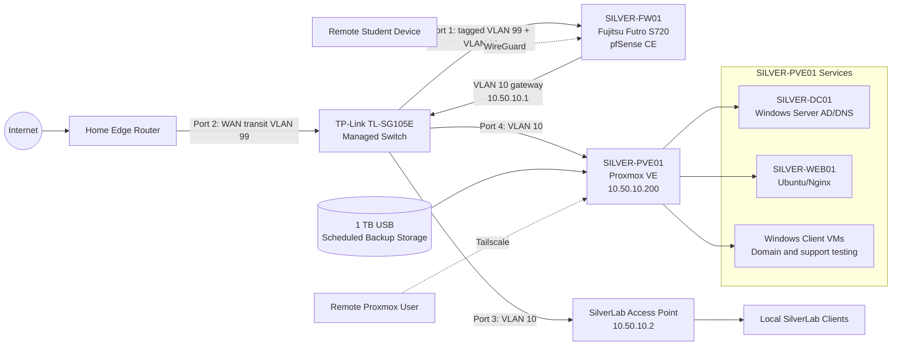

# SilverLab

SilverLab is a practical IT and cybersecurity homelab built to develop and demonstrate job-ready skills in virtualisation, networking, Windows Server, Active Directory, Linux administration, firewalling, VPN access, troubleshooting, backup operations, documentation, and multi-user lab support.

The lab uses repurposed hardware and is documented as a small-business style environment: a Proxmox infrastructure host, a dedicated physical pfSense firewall, a managed VLAN network, Windows Server domain services, Windows client VMs, an internal Ubuntu/Nginx service, secure remote access, and scheduled backups.

## Current Status

| Area | Status |
|---|---|
| Proxmox VE host | Built and operational on **SILVER-PVE01** |
| Hardware baseline | Laptop 2 upgraded to approximately **16 GiB RAM** |
| Firewall / gateway | **pfSense CE** migrated from a VM to a physical Fujitsu Futro S720 |
| Managed network | TP-Link TL-SG105E configured for router-on-a-stick VLAN operation |
| Protected lab LAN | VLAN 10 using `10.50.10.0/24`, with pfSense at `10.50.10.1` |
| WAN transit | VLAN 99 separates the upstream WAN path from the protected LAN |
| Windows Server / AD | **SILVER-DC01** provides the `silverlab.local` Active Directory environment |
| Windows clients | Multiple Windows client VMs created and joined to the domain |
| Remote student access | WireGuard access to the protected lab validated from a remote client |
| Proxmox remote access | Tailscale used for protected Proxmox management access |
| Multi-user administration | Individual student accounts and role-based Proxmox permissions configured and tested |
| Backup | 1 TB USB backup storage added with a recurring Sunday backup job |
| Documentation | Current topology and July 2026 progress update published |

## Hardware and Role Overview

| Device | Documentation name | Role |
|---|---|---|
| Laptop 1 | **SILVER-KALI-CLIENT** | Kali admin/security workstation and endpoint/client VM host. |
| Laptop 2 | **SILVER-PVE01** | Proxmox VE infrastructure host running the core server-side lab services. |
| Fujitsu Futro S720 | **SILVER-FW01** | Physical pfSense firewall using a one-NIC router-on-a-stick design. |
| TP-Link TL-SG105E | **SilverLab Managed Switch** | Provides tagged trunking and untagged access ports for VLAN 10 and VLAN 99. |
| TP-Link Archer access point | **SilverLab Access Point** | Provides wired and wireless access to the protected SilverLab LAN. |
| 1 TB USB drive | **Proxmox Backup Storage** | Local destination for scheduled VM and container backups. |
| Home router | **Home Edge Router** | Internet edge and upstream connection for pfSense WAN. |

## Current Network Overview

| Network area | Component | Address / role |
|---|---|---|
| Protected SilverLab LAN | VLAN 10 | `10.50.10.0/24` |
| Protected SilverLab LAN | pfSense gateway | `10.50.10.1` |
| Protected SilverLab LAN | SilverLab access point | `10.50.10.2` |
| Protected SilverLab LAN | Proxmox management | `10.50.10.200` |
| WAN transit | VLAN 99 | Carries the upstream pfSense WAN path |
| Emergency switch management | TL-SG105E management | `192.168.50.2` |
| WireGuard tunnel | Remote-access network | `10.50.20.0/24` |
| WireGuard tunnel | pfSense tunnel address | `10.50.20.1` |
| Active Directory | Internal domain | `silverlab.local` |

The post-migration IP address for **SILVER-DC01** is intentionally not stated here until the updated static-address and DNS baseline has been fully revalidated and documented.

### Managed Switch Port Layout

| Port | Connection | VLAN behaviour |
|---|---|---|
| 1 | Fujitsu Futro S720 / pfSense | Tagged trunk carrying VLAN 10 and VLAN 99 |
| 2 | Home edge router / WAN uplink | Untagged access port on VLAN 99 |
| 3 | SilverLab access point | Untagged access port on VLAN 10 |
| 4 | SILVER-PVE01 | Untagged access port on VLAN 10 |
| 5 | Emergency switch management | Isolated management access |



Private lab IP addresses are documented because they describe the internal lab design. Public IPs, passwords, tokens, private keys, MAC addresses, serial numbers, personal identifiers, VPN configuration exports, and certificate/key material are excluded or redacted.

## Implemented Milestones

### 1. Proxmox and Multi-User Lab Foundation

- Installed and configured Proxmox VE on Laptop 2.
- Upgraded the host from 8 GB to approximately 16 GB RAM.
- Created individual student accounts for shared practical learning.
- Configured and troubleshot role-based permissions for VM creation, storage access, ISO use, virtual bridges, snapshots, and backups.
- Diagnosed Proxmox login, storage selection, bridge selection, and snapshot permission issues.

### 2. Physical pfSense and VLAN Migration

- Migrated pfSense from a virtual machine to a dedicated Fujitsu Futro S720.
- Implemented a one-NIC router-on-a-stick design.
- Configured VLAN 10 for the protected SilverLab LAN.
- Configured VLAN 99 for the WAN transit path.
- Configured managed switch trunk and access ports.
- Moved Proxmox management into the protected VLAN 10 network.
- Preserved separation between the home network and student-accessible lab resources.

Documentation:

- [Core Infrastructure Current Baseline](docs/core-infrastructure-current-baseline.md)

### 3. Windows Server, Active Directory, and Client Support

- Maintained the `silverlab.local` Active Directory environment.
- Created and joined additional Windows client VMs to the domain.
- Practised computer-account creation, domain joining, DNS troubleshooting, local administrator recovery, and delegated administrative access.
- Prepared **SILVER-CLIENT03** for remote Active Directory access.

Documentation:

- [Active Directory, GPO, and Client Validation](docs/active-directory-gpo-client-validation.md)

### 4. Remote Access

- Retained Tailscale for protected Proxmox management access.
- Configured WireGuard on pfSense for remote access to VLAN 10.
- Created individual WireGuard peer configurations.
- Used firewall rules, status pages, packet capture, routing checks, and client-adapter troubleshooting to resolve connectivity issues.
- Successfully established a remote student connection to SilverLab.

Historical documentation:

- [pfSense and OpenVPN Remote Access](docs/pfsense-openvpn-remote-access.md)

### 5. Backup Operations

- Added and mounted a 1 TB USB drive as Proxmox backup storage.
- Created a recurring backup job scheduled for every Sunday.
- Started the first full backup run for the selected workloads.
- Added backup administration and permission troubleshooting to the multi-user learning environment.

### 6. Troubleshooting and Project Practice

- Diagnosed physical Ethernet cabling and USB network-adapter issues.
- Investigated Windows DNS, domain connectivity, and local administrator problems.
- Practised pfSense packet capture and firewall-rule troubleshooting.
- Used Jira-style project planning for future infrastructure, SQL, cybersecurity, and AI-assisted documentation work.
- Evaluated Proxmox Datacenter Manager for future centralised visibility of external nodes.

## July 2026 Progress Update

The latest documented milestone combines:

```text
Physical pfSense Migration, VLAN Segmentation, Multi-User Proxmox Access,
WireGuard Remote Access, Windows Client Support, and Scheduled Backups
```

Full update:

- [SilverLab Progress Update - July 2026](docs/progress-update-2026-07.md)

## Portfolio Skills Demonstrated

- Proxmox VE administration and virtual machine lifecycle management
- Role-based access control and multi-user platform support
- pfSense firewall deployment and administration
- VLAN design, tagged trunking, and managed-switch configuration
- Network segmentation and protected management access
- WireGuard and Tailscale remote-access implementation
- Active Directory, DNS, domain join, and Windows client troubleshooting
- Packet capture, firewall-rule testing, and structured fault finding
- Scheduled backup configuration and backup-storage administration
- Technical documentation, change tracking, and project planning

## Screenshot Evidence

Curated redacted screenshots are stored in:

```text
assets/screenshots/
```

Screenshot index:

- [Screenshot Evidence README](assets/screenshots/README.md)

## Security Principles

SilverLab documentation avoids exposing sensitive information. The repository should not contain:

- Passwords
- Private keys
- API tokens
- Tailscale authentication keys
- Public IP addresses
- Email addresses
- Personal addresses
- Unredacted MAC addresses
- Serial numbers
- UUIDs or device IDs where not required
- Router or Wi-Fi passwords
- Browser tabs containing personal information
- VPN configuration files, certificates, or exported client profiles
